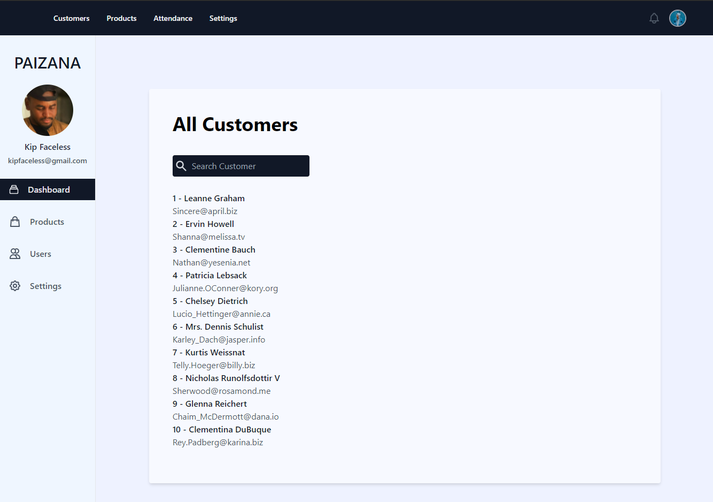

This is a [Next.js](https://nextjs.org/) project bootstrapped with [`create-next-app`](https://github.com/vercel/next.js/tree/canary/packages/create-next-app).

## Getting Started

First, run the development server:

```bash
npm run dev
# or
yarn dev
```

Open [http://localhost:3000](http://localhost:3000) with your browser to see the result.

You can start editing the page by modifying `pages/index.js`. The page auto-updates as you edit the file.


## About This Project 
### It is a simple ongoing project, with the main objective of practicing the concepts learned about the Next.js framework.

## Technologies used in this project
- Next.js
- Vanila Javascript
- React.js
- Tailwind.css

##
 </img>
 </img>
 
 


### Below are some screenshots of how the project is coming along.

#

